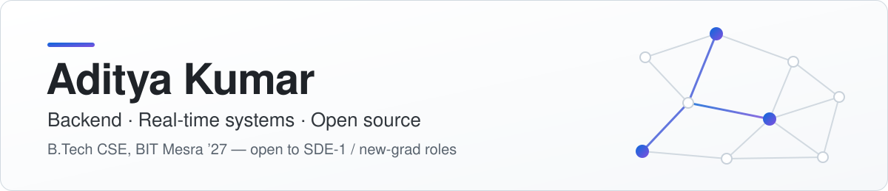
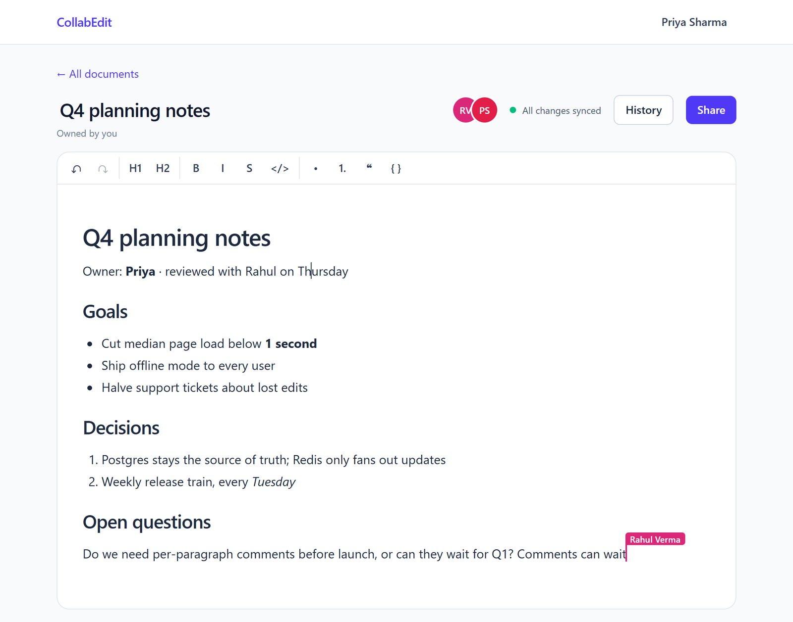

<picture>
  <source media="(prefers-color-scheme: dark)" srcset="assets/banner-dark.svg">
  
</picture>

  
  
  
  
  

I'm a final-year Computer Science student at **BIT Mesra** (graduating **May 2027**), looking for **SDE-1 / new-grad** software engineering roles.
I like the backend side of real-time products — sync protocols, storage, rate limiting, and the bugs that hide in shared state — and I fix those bugs in other people's code too: my patches are merged in **Microsoft's Agent Framework** and **LibreDB Studio**.

- 🔀 **<!-- MERGED:START -->10 merged pull requests<!-- MERGED:END -->** in open source, including fixes in [microsoft/agent-framework](https://github.com/microsoft/agent-framework) — with more in review at pytest, Swift, Mermaid and Zulip
- 🚀 **[CollabEdit](https://github.com/Aditya-XR/collaborative-editor)** — a live Google Docs–style editor on a CRDT sync server I wrote in Python, with 250+ automated tests
- 🏆 **70th of 8,500+ teams** in the Amazon ML Challenge 2026 · 🥇 **1st place** at Hatch From Scratch (AR indoor navigation)
- 🧮 **600+ DSA problems** solved in C++ · LeetCode contest rating peaked at **1605**

## 🚀 Featured project — CollabEdit

Real-time collaborative documents in the spirit of Google Docs — live cursors, offline editing, version history, full-text search and link sharing — built from scratch on FastAPI, Yjs/pycrdt, PostgreSQL and Redis.

**[▶ Try it live](https://collaborative-editor-flax.vercel.app)** · [Source](https://github.com/Aditya-XR/collaborative-editor) · [Design decisions (ADRs)](https://github.com/Aditya-XR/collaborative-editor/tree/main/docs/adr) · [Roadmap](https://github.com/Aditya-XR/collaborative-editor/blob/main/docs/PLAN.md)

- **Own sync server.** FastAPI WebSockets speak the Yjs sync and awareness protocols on top of pycrdt (Rust Yrs): one room per open document, per-connection send queues, and roles enforced on every update. In production, edits reach other users in about 110 ms.
- **Edit log + compaction.** Every edit lands in an append-only Postgres log (batched every 500 ms) and is folded into snapshots under an advisory lock — opening a 10,000-keystroke document went from **218 ms to 17 ms**.
- **Self-built rate limiter.** A token bucket in one Redis Lua script: atomic across API instances, in a single round trip.
- **Careful sessions.** Argon2id passwords, 15-minute JWTs, rotating refresh tokens with reuse detection, and one-time WebSocket tickets.
- **Offline-first.** The browser keeps an IndexedDB copy, and offline edits merge automatically when the connection returns.
- **Tested and documented.** 173 API tests against real Postgres and Redis (including Hypothesis convergence properties) and 79 web tests run in CI on every push; 10 architecture decision records explain the trade-offs.

## 🔧 Open source

I look for real bugs in projects I use, reduce them to a minimal reproduction, and fix them with regression tests. Some favourites:

- **[microsoft/agent-framework #8660](https://github.com/microsoft/agent-framework/pull/8660)** — `is_type_compatible` special-cased `Any` only as a target type, so workflow edge validation rejected executors declaring `WorkflowContext[Any]`.
- **[microsoft/agent-framework #8648](https://github.com/microsoft/agent-framework/pull/8648)** — middleware type detection failed under `from __future__ import annotations`; postponed (PEP 563) annotations are now resolved before dispatch.
- **[libredb/libredb-studio #1121](https://github.com/libredb/libredb-studio/pull/1121)** — a single `SELECT`, `AUTH` or `HELLO` could silently move or re-authenticate the Redis connection shared by every later request; blocked at the provider boundary after verifying each command against live Redis 8.

<!-- OSS:START -->
**✅ Merged** — 10 pull requests in 4 projects

| Project | Pull requests |
| :-- | :-- |
| [zulip/zulip](https://github.com/zulip/zulip) ★ 26k | [Fix API URL in Home Assistant documentation](https://github.com/zulip/zulip/pull/40197) |
| [microsoft/agent-framework](https://github.com/microsoft/agent-framework) ★ 14k | [Fix persistent PowerShell sessions dropping table-formatted output](https://github.com/microsoft/agent-framework/pull/9043) [Fix middleware type detection with postponed annotations](https://github.com/microsoft/agent-framework/pull/8648) [Fix type compatibility for Any source types](https://github.com/microsoft/agent-framework/pull/8660) |
| [libredb/libredb-studio](https://github.com/libredb/libredb-studio) ★ 1.2k | [Write a zoned Oracle timestamp that arrived over HTTP as its UTC instant](https://github.com/libredb/libredb-studio/pull/1500) [A disconnect during an in-flight connect closes that attempt's driver](https://github.com/libredb/libredb-studio/pull/1308) [Read DATE and TIMESTAMP as the stored wall clock, not a local Date](https://github.com/libredb/libredb-studio/pull/1225) [Refuse commands that move the shared connection](https://github.com/libredb/libredb-studio/pull/1121) [Anchor schema diff migration copy button outside scroll area](https://github.com/libredb/libredb-studio/pull/1082) |
| [anishmehta24/OSS-Contributor-engine](https://github.com/anishmehta24/OSS-Contributor-engine) | [Preserve CRLF line endings when applying edits](https://github.com/anishmehta24/OSS-Contributor-engine/pull/3) |

**🔄 In review** — 8 open

| Project | Pull requests |
| :-- | :-- |
| [mermaid-js/mermaid](https://github.com/mermaid-js/mermaid) ★ 90.6k | [Allow milestones to be declared without a duration](https://github.com/mermaid-js/mermaid/pull/8291) |
| [swiftlang/swift](https://github.com/swiftlang/swift) ★ 70.5k | [Document source.request.relatedidents](https://github.com/swiftlang/swift/pull/92586) |
| [zulip/zulip](https://github.com/zulip/zulip) ★ 26k | [Replace deprecated URI with URL in avatar/logo settings](https://github.com/zulip/zulip/pull/40191) |
| [pytest-dev/pytest](https://github.com/pytest-dev/pytest) ★ 14.6k | [Fix `WarningsRecorder.pop()` returning the last match for unrelated categories](https://github.com/pytest-dev/pytest/pull/15098) |
| [microsoft/agent-framework](https://github.com/microsoft/agent-framework) ★ 14k | [Reset Magentic participant sessions on replan](https://github.com/microsoft/agent-framework/pull/9131) [Read AZURE_OPENAI_API_VERSION before applying the Azure client default](https://github.com/microsoft/agent-framework/pull/9098) [Fix tool argument validation for datetime, set and tuple parameters](https://github.com/microsoft/agent-framework/pull/8824) |
| [libredb/libredb-studio](https://github.com/libredb/libredb-studio) ★ 1.2k | [Read DATETIME and SMALLDATETIME as the engine's own text, and export them with a T](https://github.com/libredb/libredb-studio/pull/1639) |

Both tables refresh daily from the GitHub API.
<!-- OSS:END -->

## 🧰 Tech

  

**Also:** SQLAlchemy · Alembic · WebSockets · Socket.IO · Yjs / CRDTs · JWT · OAuth 2.0 · pytest · Hypothesis · Vitest · Render · Vercel

**CS fundamentals:** data structures & algorithms, operating systems, computer networks, DBMS

---

  📫 <a href="mailto:adityaccds@gmail.com">adityaccds@gmail.com</a> · <a href="https://www.linkedin.com/in/aditya-kumar-37b82627b">LinkedIn</a> — happy to talk about backend roles, real-time systems, or anything above.

